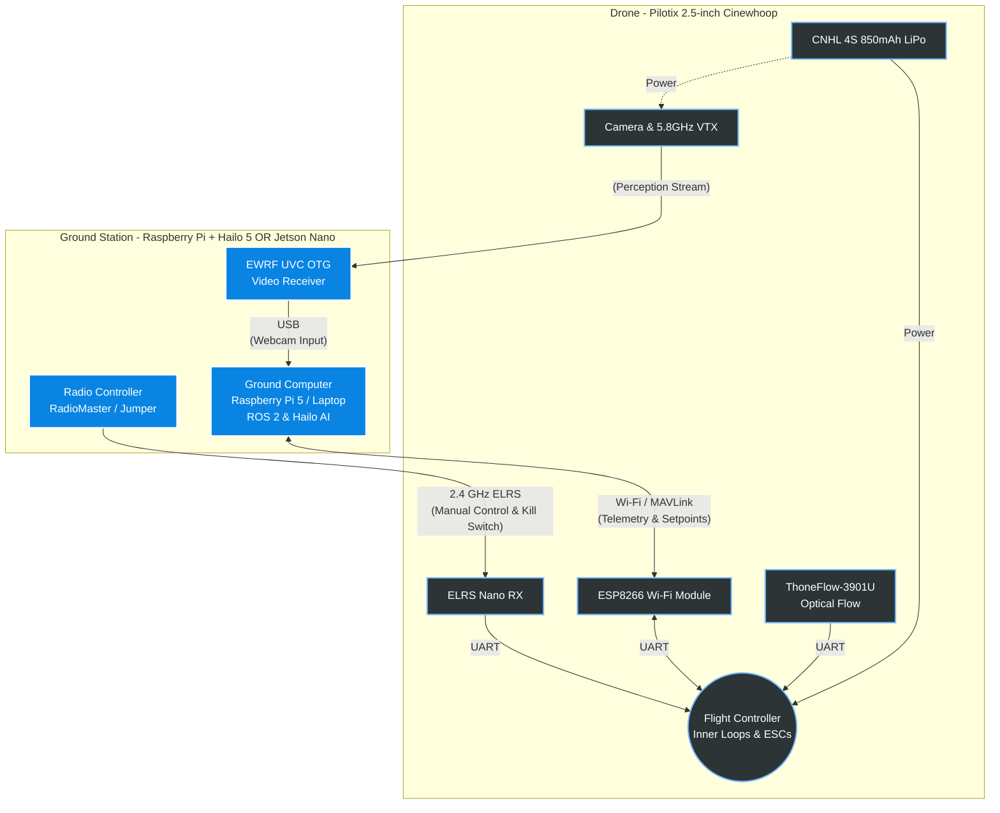

# 01 · Aerial Micro-Drone

A small, fast, fragile flying robot. The drone class is where real-time control, state estimation, and failsafe design meet a machine that will crash if your code is late.

## The Platform

The unit is a **Pilotix Brook 2.5-inch cinewhoop** quadcopter: ducted propellers, 4S LiPo power, analog FPV video. The class fleet has two flying units plus spare frames, batteries and radio parts.

### Bill of Materials (BOM) & Roles

| Component | Role |
|---|---|
| **Flight Controller (onboard)** | Runs the inner attitude and rate loops at high frequency. Reads the IMU and drives the motors. Your code never replaces this loop. It sends setpoints to it. |
| **ELRS 2.4GHz Nano Receiver** | Receives commands from the handheld radio. This is the manual control path and the **kill switch** if the autonomy fails.  (Must be soldered onto the PNP version). |
| **Radio Transmitters** | **RadioMaster Pocket ELRS (Charcoal):** Primary handheld radio used by the instructor or safety pilot. **Jumper T-Lite V2 (JP4IN1/ELRS):** Secondary radio for trainer mode or backup. |
| **ESP8266 Wi-Fi Module (Wemos D1 mini)** | Connected to a flight controller UART. Bridges telemetry and setpoints over Wi-Fi between the drone and the ground computer. |
| **ThoneFlow-3901U Optical Flow Sensor** | UART sensor that measures ground motion from a downward-facing camera. Enables position hold without GPS. |
| **Analog Video System** | **Onboard VTX:** Streams analog video to the ground. **EWRF 5.8GHz 56CH UVC OTG Receiver:** Ground receiver connected via USB. This is your perception input. |
| **CNHL 4S 14.8V 850mAh** | Main flight power. Expect a few minutes of flight per pack. 
| **Ground Computer** | Laptop with GPU, or Raspberry Pi 5 with Hailo AI HAT+. Runs ROS 2, perception, and mission logic. |

**Key architectural fact:** A 2.5-inch drone cannot carry a companion computer. Perception and planning run on the ground, and the drone receives setpoints over a wireless link. Latency and link loss are therefore design inputs, not edge cases.

## System Architecture Diagrams

### 1. Communication and Control Data Flow

## Key aspects

- **Hard real-time stability.** The flight controller closes the attitude loop in hardware. Your job is the outer loops: velocity, position, mission.
- **GPS-denied state estimation.** Indoors there is no GPS. Position comes from optical flow, IMU integration and, later, visual-inertial odometry from the camera.
- **Failsafe by design.** Link loss must lead to hover or controlled landing. Low battery must trigger return-to-base. The radio kill switch always has priority.
- **Simulation first.** Flight behaviours are developed in Gazebo with PX4 SITL, then transferred. The onboard controller firmware differs from the simulated one, so the sim-to-real gap must be measured and documented.

## Example applications

- Inspection of toll gantries and high-voltage power line towers (corrosion, insulator damage, cable sag).
- Inventory scanning in high-bay warehouses: GPS-denied flight in narrow 12 m aisles, barcode reading.
- Solar farm hotspot detection and crop health mapping.
- Coastal patrol: swimmer distress detection and marine litter tracking.
- Aerial scouting that hands target coordinates to a ground robot (Module 3 scenarios).

## Expected challenges

- **Latency budget.** Camera → ground → inference → setpoint → drone. Every hop adds delay, and a slow loop makes the drone oscillate. urthermore, the standard definition analog video adds noise that the perception algorithms must handle efficiently. 
- **Short flight time and high wear.** Plan test sessions around battery cycles. Crashes cost frames and propellers.
- **Noisy state estimation.** Optical flow needs texture and a height estimate. Fusion with the IMU is required to get usable position.
- **Two firmwares.** The onboard flight controller stack and the simulated autopilot expose different interfaces. Abstract them behind one ROS 2 interface.
- **Safety discipline.** Cage rules, safety pilot on the radio, LiPo handling. No exceptions.
